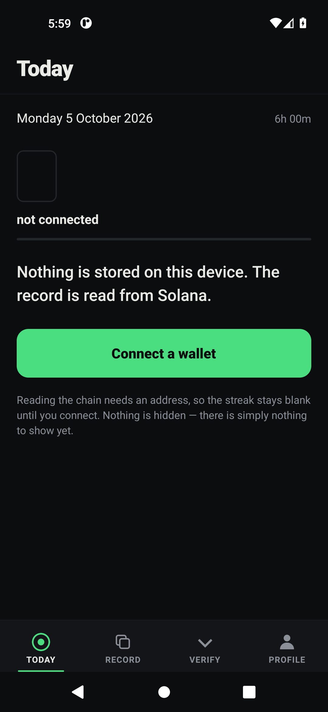

# Clock In

One round a day. Hold for ten seconds, seal it, and the streak you see is read
back out of Solana rather than out of anything this app stored.

Android, Solana devnet, React Native, and the official Mobile Wallet Adapter.
Built for the Solana Mobile Clock In hackathon and verified on a physical
Android 11 device — the installable APK is attached to the
[v1.0.0 release](../../releases/tag/v1.0.0).



## The act

**Today** answers one question: is today sealed? **Record** is where the act
happens — press and hold for ten seconds and the round qualifies. Sealing then
asks your wallet to sign a single transaction carrying one memo:

```
clock1|2026-10-06|motion|10022|1000|manual|1
```

Positionally, that is the round's date, the act, the measured hold in
milliseconds, the sample interval, how the attestation was produced, and the
record version. Your wallet signs it. This app never sees a key and cannot move
a lamport.

## The design decision

**The app is not the source of truth.**

Nothing about your round is written to local storage. On every launch the streak
is read back out of the wallet's on-chain history and recomputed. Delete the app,
clear its data, install it again — the days come back, because they were never in
the app in the first place.

That is the entire point. A streak held in a local database is a claim by the
app. A streak recomputed from a chain of signed transactions is a claim anyone
can recheck without asking the app, or us, for permission.

## What it does not prove

The ten-second hold is **self-reported**. There is no camera, no sensor and no
witness. Nothing on the chain proves that a body held a button — the app measured
a hold, and the wallet signed the app's word for it.

The app states this on its own Verify screen instead of leaving it for a judge to
find. That is the most interesting thing about the design: the record is narrow,
and honest about being narrow, which is exactly what makes it usable as evidence
of anything at all.

## What is actually verified

**On chain.** The devnet wallet
`3BdNH5bHn7qpe4MaW8vSM8MiQTr5cAenWKeYxBXGwMPR` holds six transactions and two
valid seals:

| sealed day | signature |
|---|---|
| 2026-10-05 | `2s3LKgk2GqjmqTJMgh4G6JMGBGCk5s3ptQGrhczgnkQ33m27678qTxyTXfz8RaJeK4rNvzNJrgXCw4hhhM7AbXvh` |
| 2026-10-06 | `2fegjPt2J4v82XoWD85b3weHygymVgT8PhmB8gCunmTDZ11xStifsmfwJ3gjP6VHr5yFuw6pyeDrGLiSz13AkFA5` |

**By the verifier.** `verifier/verify.mjs` is 377 lines with **no dependencies at
all** — no npm install, no database, no server, no build step, and no copy of the
app's code. Node 18+ is the only requirement, because it ships `fetch`. If
rechecking the record required trusting our binary, our schema or our uptime, the
record would not be worth much.

```bash
node verifier/verify.mjs 3BdNH5bHn7qpe4MaW8vSM8MiQTr5cAenWKeYxBXGwMPR
node verifier/verify.mjs --self-test
```

It prints the transactions scanned, the valid seals, the sealed days, the current
streak, and whether the sequence is continuous or exactly where it breaks.
Decoding is strict on purpose: anything that does not match the record format
exactly is reported as malformed rather than guessed at.

**In CI.** Four workflows that assert rather than assume:

- `Android APK` builds the APK and checks that the React Native JS bundle is
  inside it, and that both `arm64-v8a` and `x86_64` native libraries are present.
- `Emulator smoke test (MWA)` boots an emulator, installs the APK, launches it,
  and asserts from logcat that the JS ran and nothing crashed natively.
- `UI capture` drives the running app and pulls real screenshots — including one
  taken *after* a hardware back-key event, which is how the Android back
  behaviour is proven rather than inspected.
- `Deck` renders the pitch deck to PNG and PDF.

**On the device.** Installed and used on a physical Infinix HOT 10T running
Android 11 with Phantom as the wallet. The signature in the demo video is
produced by the wallet app, never by this code.

## Running it yourself

```bash
cd mobile
npm install
cd android && gradle :app:assembleDiagnostic
adb install -r app/build/outputs/apk/diagnostic/app-diagnostic.apk
```

Install a wallet first. On a plain emulator the official mock wallet is enough:

```bash
npx solana-mobile@latest device install fakewallet
```

## Devnet only

`mobile/src/config.ts` points at `https://api.devnet.solana.com`. No mainnet
endpoint appears anywhere in this repository, and the app holds no funds.

## Repository layout

```
mobile/      the Android app — React Native, MWA, the round domain
verifier/    the standalone chain verifier, zero dependencies
deck/        the pitch deck source, real screenshots, and the renderer
film/        the 1:28 demo video and its captions
design/      the motion and layout plans
.github/     the four CI workflows
```

## Notes that cost time to learn

- MWA is Android-only. There is no iOS path.
- Polyfills (`react-native-get-random-values`, `buffer`) must load before any
  Solana import, or signing fails before the wallet opens.
- MWA address fields are **base64**; decoding them any other way yields a
  plausible but wrong public key.
- `minContextSlot` is passed to avoid "payloads invalid" when a blockhash
  expires while the approval sheet is open.
- `authorize` is called rather than `reauthorize`, because a stale reauth token
  fails silently.
- Gate on the Seeker Genesis Token, never on `Platform.constants.Model`, since an
  emulator and a Seeker can run identical code.
- Sealing writes a memo, not a transfer. The EIP-style temptation to send a
  token amount would have made the record depend on a token's continued
  existence; a memo is readable from the transaction alone.

## Honesty notes

- The demo video's narration is a **synthetic voice**, and the film says so on
  screen.
- The demo video does **not** show the app's storage being wiped, because that
  shot was never taken. The narration was rewritten rather than left asserting a
  wipe the pictures do not show.
- Revenue from this project to date: **$0.00**.
